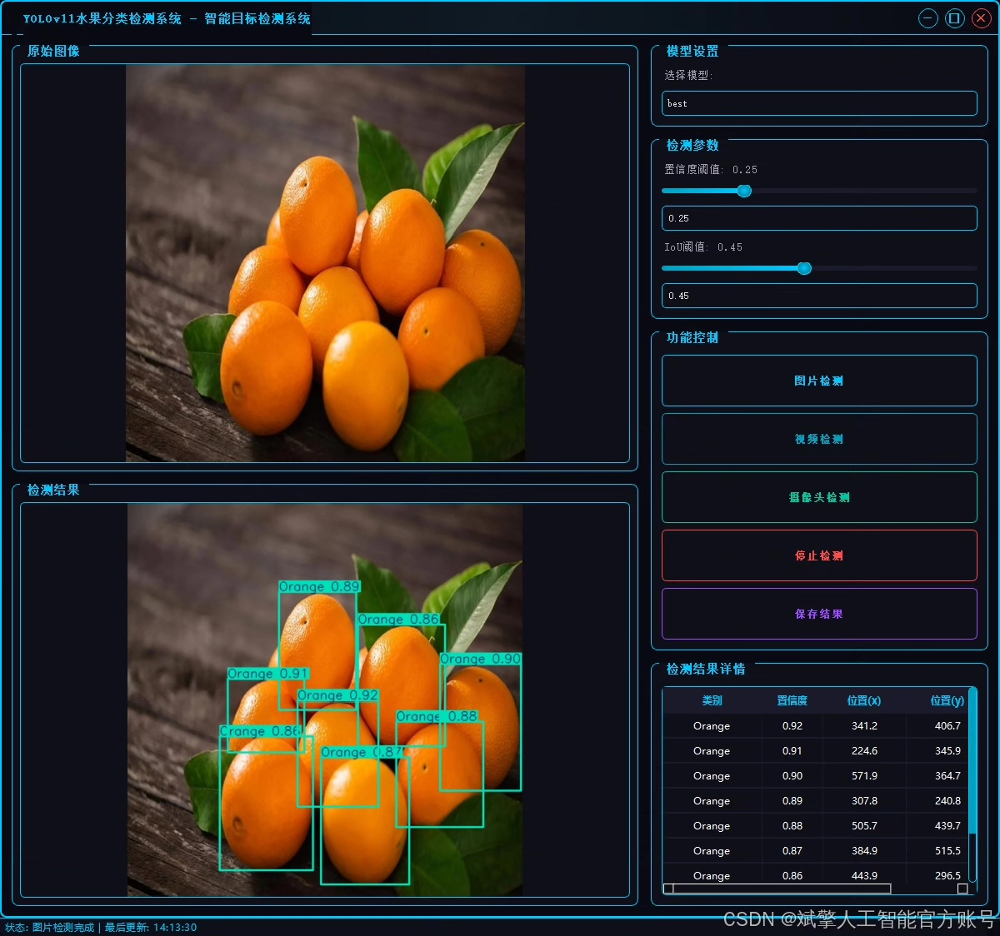
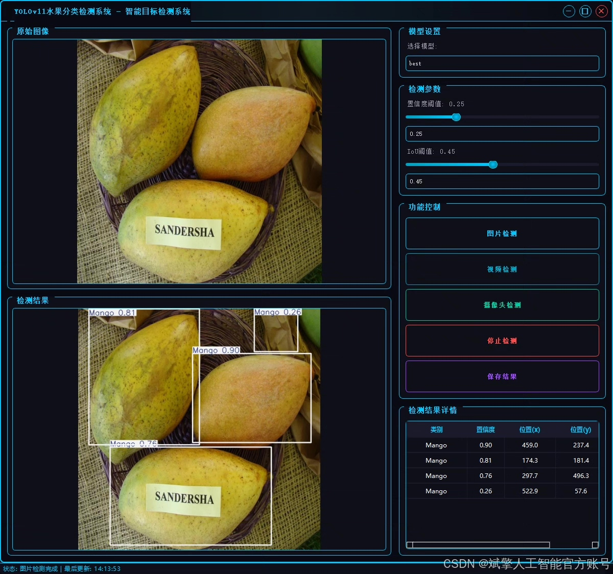
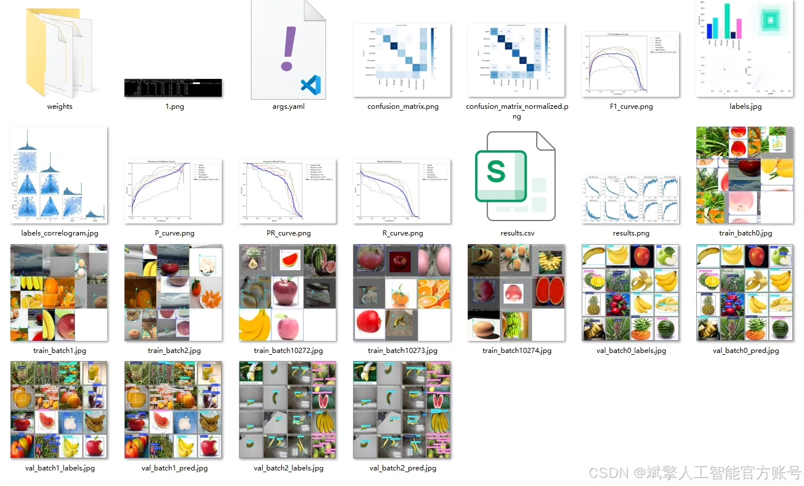
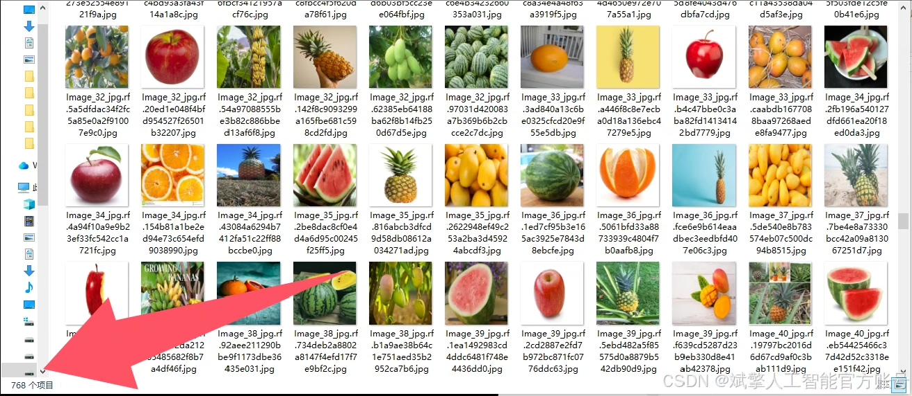
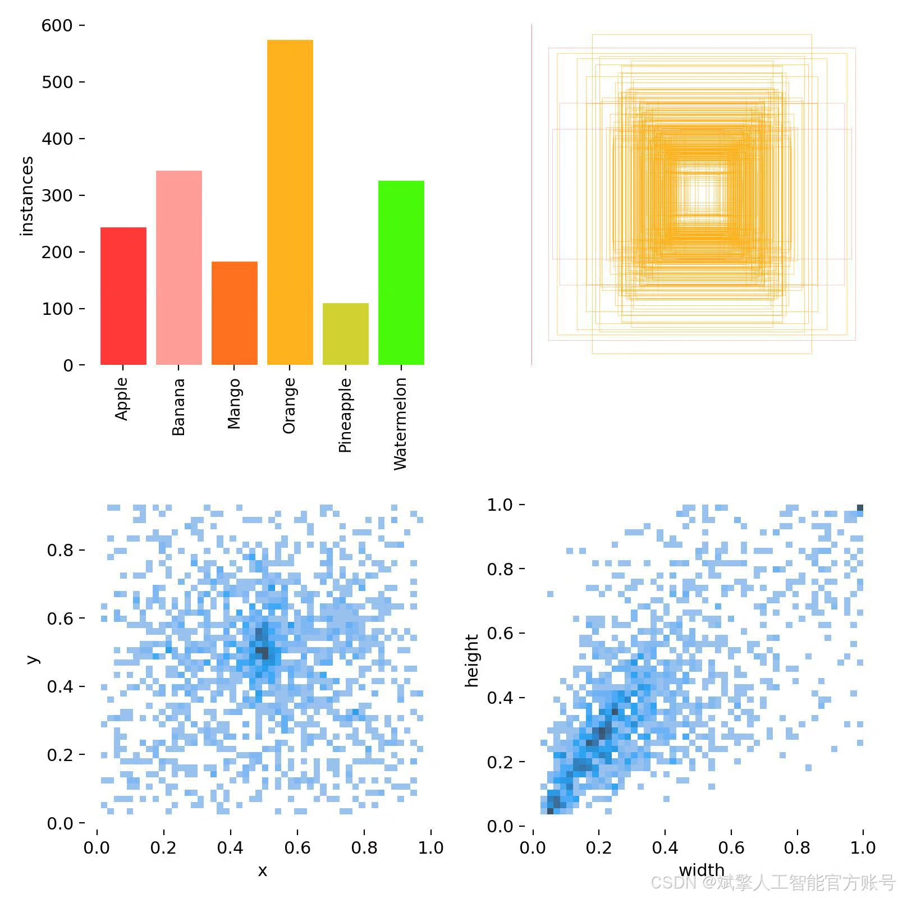
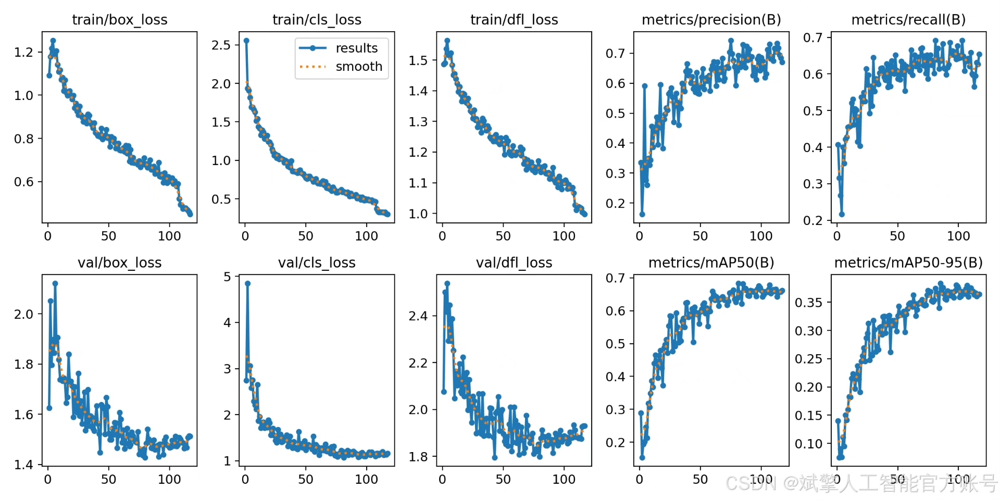
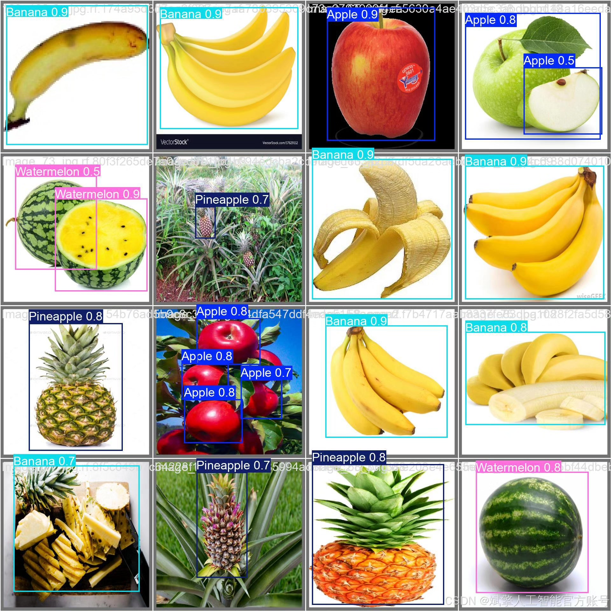
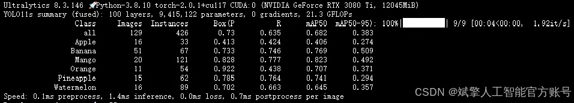

# YOLOv11 Fruit Identification System

## Body

YOLOv11 is a fruit recognition system developed by the University of Oxford. It uses deep learning to identify and classify different types of fruits in images. The system is trained on a large dataset of fruit images, which allows it to accurately recognize and identify different types of fruits.

(Full product description was not available from the source page.)

## Images

## Payment

Here is a pay link on Stripe ( https://buy.stripe.com/3cs8yP7sY87d0vu9AB ). Please contact me lonlonago@foxmail.com after funding $89, and I will send you a complete data files , thank you!

